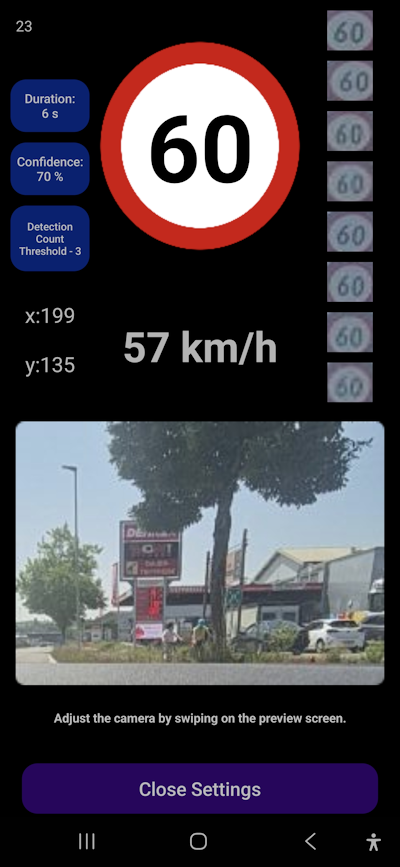
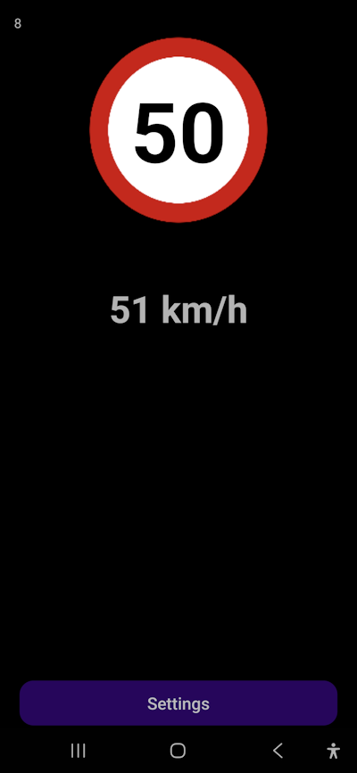
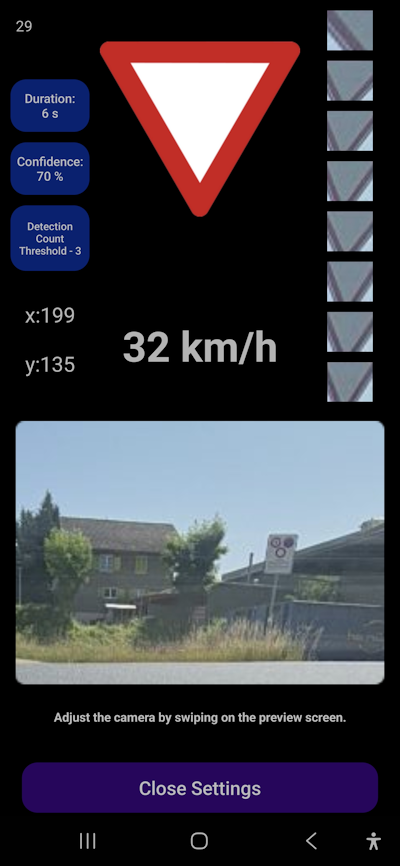

# 🚘 SpeedLimitDetector

**SpeedLimitDetector** is an Android app that uses the camera and GPS to detect speed limit signs and the "yield" traffic sign. It alerts the driver with a sound notification when they exceed the allowed speed or approach a yield sign.

---

## ✨ Features

- 📷 Detects **speed limit signs** using the camera and displays them on screen.
- ⚠️ Detects the **yield ("give way") sign** and warns the driver.
- 🚗 Compares the detected sign with the current **GPS speed** (in km/h).
- 🔊 **Plays a sound alert** when the user exceeds the speed limit.
- 🎥 Shows **camera frames per second (FPS)** in the top-left corner to indicate app performance on the current device.
- ⚙️ Allows adjustment of **detection confidence**, number of signs processed, and camera positioning.

---

## 🛠️ Technologies Used

- Kotlin  
- AndroidX  
- ML Kit  
- TensorFlow Lite  

---

## 🧰 Requirements & Development Environment

- ✅ **minSdk**: 28  
- ✅ **targetSdk**: 35  
- ✅ **compileSdk**: 35  
- ✅ **Gradle**: 8.2.0  
- ✅ Compatible with Android Studio Hedgehog (2023.1.1) and Meerkat (2024.3.2)

---

## 📱 Tested Devices

| Device                  | Average FPS | Notes                                |
|-------------------------|------------:|--------------------------------------|
| Samsung Galaxy S22      |     10–15   | Works well, set `signs count = 1`    |
| Samsung Galaxy S24 Plus |     18–22   | Excellent performance, set `signs count = 3` |

---

## 📌 Tips for Best Results

### 📷 1. **Camera Position is Crucial**

For best detection accuracy, make sure to position the camera **carefully**. Poor positioning can lead to unreliable or missed detections.

🔧 You can **adjust the camera view** by swiping on the preview screen in the settings.

✅ **Recommended setup**:

* Position the **left edge of the frame** so it slightly runs **along the edge of the road**, but **not over it**.
* In the preview, the road should be **barely visible** — or **not visible at all**.
* Taking a few seconds to position the camera properly makes a **huge difference** in performance.

### 🎯 2. **Detection Confidence**

Set a reasonable confidence threshold:

* Best results are usually between **70% and 85%**
* Too low: risk of false positives
* Too high: risk of missing valid signs

### 📊 3. **Number of Signs Processed**

This affects how many objects are tracked per frame:

* **Weaker devices** (low RAM/CPU): set to `1`
* **Stronger devices**: try `2–5` for better detection coverage

### ⏱️ 4. **Performance and FPS**

* If your FPS drops **below 10**, the app may become unusable
* This typically happens on older or phones

### 🌦️ 5. **Weather & Lighting Conditions**

Detection accuracy is affected by environment:

* **Rain**, **fog**, or **direct sunlight** can severely reduce performance
* For best results, use in **clear daylight** or good lighting conditions

---

## 🚀 Getting Started

1. Clone the repository:
   ```bash
   git clone https://github.com/jezierski999/SpeedLimitDetector-Android-TensorFlow.git
   ```
2. Open the project in **Android Studio**.
3. Ensure SDK versions and Gradle settings match the above requirements.
4. Run the app on a real Android device (API level 28+).
5. Grant camera and location permissions when prompted.

---

## 📸 Screenshots

<p align="center">
  
  
  
</p>

<p align="center">
  
</p>
---

## 👤 Author

jezierski999@gmail.com
---

## 🧪 Project Status

This is a side project that is **occasionally updated** as new ideas arise. Expect occasional improvements and optimizations.

---
This project is not licensed for reuse. Please contact the author if you'd like to use it.

